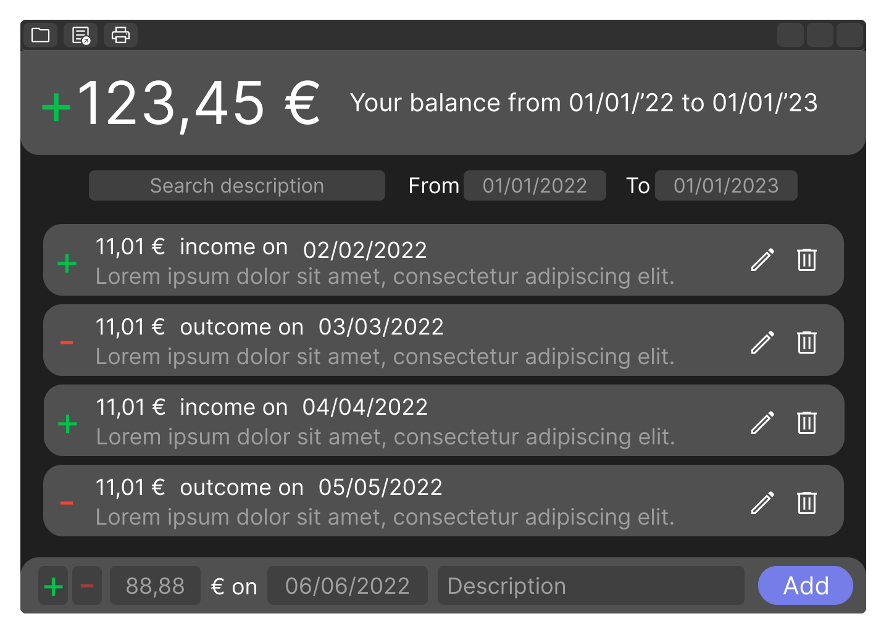
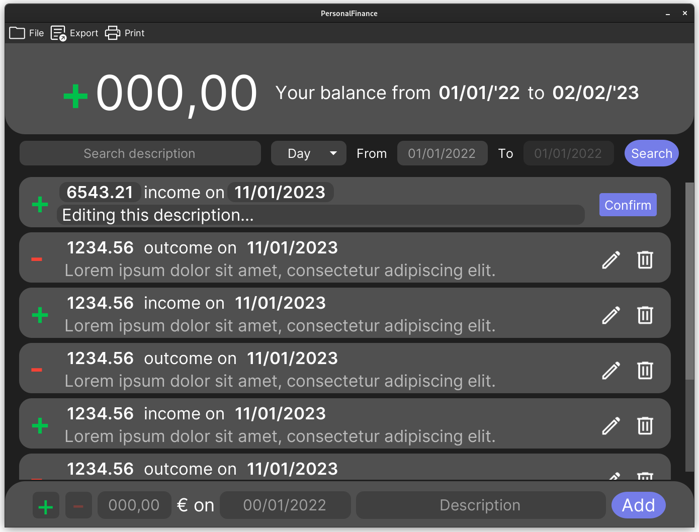

# PersonalFinance
## UI Design


## End Result


## Usage
### 4Users

 1. Download the latest release at [https://github.com/mc-cat-tty/PersonalFinance/releases/latest](https://github.com/mc-cat-tty/PersonalFinance/releases/latest)
 2. Run **PersonalFinance.jar** through the gui (usually by double clicking it) or through the cli (`java -jar PersonalFinance.jar`)

### 4Devs
```bash
mkdir build && cd build
cmake .. && make
```

On Windows you might need to use `-G "MinGW Makefiles" option to set the generator.

Run target (inside _build_ directory):
```bash
make run
```

Generate doc (inside _build_ directory):
```bash
make gendoc
```

## Assets
 - Inter Font: [https://fonts.google.com/specimen/Inter](https://fonts.google.com/specimen/Inter)
 - Material Icons: [https://fonts.google.com/icons](https://fonts.google.com/icons)
 - Material Colors: [https://mui.com/material-ui/customization/color/](https://mui.com/material-ui/customization/color/)

## Documentation
[docs/html/index.html](docs/html/index.html)

## Bugs
Feel free to report any bug or issue by opening a issue marked as _bug_ or _enhancement_